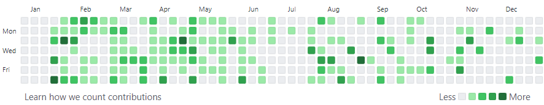

回顾去年定下来的目标，好像都没有完成。但还是厚着脸皮来总结一下。

## 技能

### 双拼

2021 年初开始练习双拼。刚开始打字的时候需要对着键位表打字。联系大概半年，已经很熟练了，打字的效率确实提升了不少。

不过微软双拼有个缺点，需要用到 `o` 和 `;` 键。今年准备试试别的双拼方案。

### 操作系统内核

去年寒假在家开始学习内核，准备在一年的时间里写一个简单的玩具内核。

今年的 GitHub 的贡献大部分都是这个仓库的提交🤣。
不过，断断续续地写，这个内核现在也只是写到了大概一半。

### Rust

今年开始学习 Rust ，不得不说入门是真的难。

我认为它的学习曲线比 C++ 还陡，但是想写出可靠的代码肯定是比 C++ 简单。毕竟 C++ 的坑太多了。

2022 年再继续深入学习一下。

### 看书 / 听书

* [平凡的世界](https://book.douban.com/subject/10517238/)（听完）
* [白鹿原](https://book.douban.com/subject/1085799/)（听完）
* [美丽新世界](https://book.douban.com/subject/27002046/)
* [三体 2 和 3](https://book.douban.com/subject/3066477/)
* [Unix 编程艺术](https://book.douban.com/subject/11609943/)
* [人类简史](https://book.douban.com/subject/25985021/)
* [原则](https://book.douban.com/subject/27608239/)
* [非暴力沟通](https://book.douban.com/subject/3533221/)

在 8 月准备重新培养阅读，所以今年读的书不是很多。

## 剧 / 电影

* [双城之战](https://movie.douban.com/subject/34867871/)（挺好看）
* [黑客帝国 1 2 3](https://movie.douban.com/subject/1291843/)（经典）
* [半泽直树](https://movie.douban.com/subject/24697949/)（爽剧）
* [信条](https://movie.douban.com/subject/30444960/)（电影院看了 15 分钟后就蒙了，二刷还没完全懂）
* [阿 Q 正传](https://movie.douban.com/subject/1306506/)（阿 Q 至今任然有无数的后代）
* …

## 设备

* 小米手环 6（买来是来运动的，现在只用在闹钟）
* 墨案 inkPad X 电子书（10 英寸的墨水屏，看 PDF 也很好）
* Sony WF1000XM4（降噪不错，带上就像聋了一样😂😂）
* …

## 2022

2021 年，一整年都在出差。过时的技术、无休止的 CURD 。让我一直处于焦虑中，让我一直后悔选择了出差，我需要尽快逃离这个地方，回学校去。2022 年，我希望：

* 尽早回学校
* 读 20 本书以上
* 养成记账的习惯
* 学习一下分布式，实现 raft 算法
* 真正的参与开源项目，而不是自娱自乐
* 多刷一些题，找个好实习，找个好工作