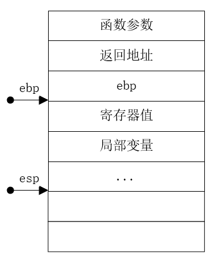
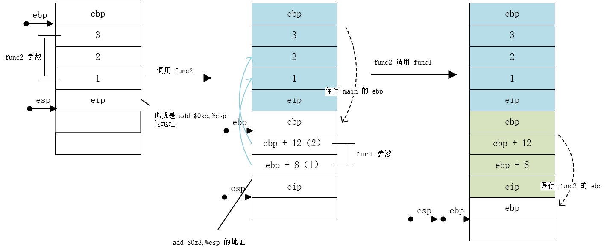
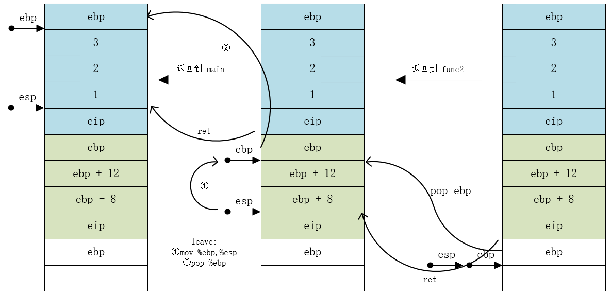

## C 函数过程调用（栈帧）

所谓的内存四区就是栈、堆、代码区和全局变量区。栈区主要就是用来实现函数调用的区，其由函数自动维护。

### 栈帧

对于每一次函数调用的时候，程序会自动维护一个过程调用的记录，也就是栈帧。一个典型的栈帧，需要包括以下几个方面：



### 在调用一个函数时会发生什么？

对于一个维护栈帧而言，其最重要的莫过于就是这两个寄存器了：

* `esp` 是栈指针寄存器，其中存放的地址始终指向栈顶。在有 `push` 指令压栈时，它的地址会自动减小（栈是由高地址到低地址）

* `ebp` 是基址指针寄存器，其指向当前栈帧的底部，通过和 `esp` 配合可以维护栈帧，通过 `ebp` 也可以获取函数的参数返回值

把 `esp` 和 `ebp` 带上后，调用一个函数，会有以下步骤：

1. 函数参数依次，如果是 gcc，则默认由右向左（`cdecl`）
2. 保存函数返回后需要运行的地址，也就是调用函数之后的语句
3. 进入调用函数，将 `ebp` 压栈，保存上一个栈帧的 `ebp`
4. 设置新的栈帧
5. 做这个函数该干的事
6. 释放栈帧，将栈帧切换到上一个栈帧（也就是步骤 4和 3 的相反步骤）
7. 返回，执行该函数之后的语句

### 实例 x86 

```c
int func1(int a, int b)
{
  return a + b;
}

int func2(int a, int b, int c)
{
  return func1(a, b) + c;
}

int main()
{
  func2(1, 2, 3);
  return 0;
}
```

使用命令：

```bash
gcc test.c -c -o test.o -fcf-protection=none -mmanual-endbr -m32
objdump -S -d test.o > test.txt
```

反编译得到的结果（删了一点不相关的内容，这些是 gcc 自动加进去的）是：

```assembly
test.o:     file format elf32-i386


Disassembly of section .text:

00000000 <func1>:
   0: 55                    push   %ebp
   1: 89 e5                 mov    %esp,%ebp
   d: 8b 55 08              mov    0x8(%ebp),%edx
  10: 8b 45 0c              mov    0xc(%ebp),%eax
  13: 01 d0                 add    %edx,%eax
  15: 5d                    pop    %ebp
  16: c3                    ret

00000017 <func2>:
  17: 55                    push   %ebp
  18: 89 e5                 mov    %esp,%ebp
  24: ff 75 0c              pushl  0xc(%ebp)
  27: ff 75 08              pushl  0x8(%ebp)
  2a: e8 fc ff ff ff        call   2b <func2+0x14>
  2f: 83 c4 08              add    $0x8,%esp
  32: 8b 55 10              mov    0x10(%ebp),%edx
  35: 01 d0                 add    %edx,%eax
  37: c9                    leave  
  38: c3                    ret    

00000039 <main>:
  39: 55                    push   %ebp
  3a: 89 e5                 mov    %esp,%ebp
  46: 6a 03                 push   $0x3
  48: 6a 02                 push   $0x2
  4a: 6a 01                 push   $0x1
  4c: e8 fc ff ff ff        call   4d <main+0x14>
  51: 83 c4 0c              add    $0xc,%esp
  54: b8 00 00 00 00        mov    $0x0,%eax
  59: c9                    leave  
  5a: c3                    ret    

Disassembly of section .text.__x86.get_pc_thunk.ax:

00000000 <__x86.get_pc_thunk.ax>:
   0: 8b 04 24              mov    (%esp),%eax
   3: c3                    ret
```

#### 汇编扫盲

在分析汇编代码之前，先对汇编简单地扫扫盲：

1. 一般来说，x86 架构地芯片的 32 位寄存器都是 8086 上 32 位寄存器的扩展。比如 64 位的寄存器 `rax` 其低 32 位就是 `eax`，其 低 16 位就是 `ax`，`ax` 的高 8 位是 `ah`，低 8 位是 `al`
2. `esp` 寄存器是栈指针寄存器。其中存放的地址始终指向栈顶
3. `eip` 指令寄存器。保存着 cpu 执行下一条代码的地址。cpu 在执行代码之前会从 `eip` 所指的内存找代码
4. `call` 指令会做两件事：
   1. 将 `eip` 入栈
   2. `jmp` 跳转到指定的地址处执行
5. `ret` 指令，`pop eip`，这样就能接着运行了
6. `ebx` 通用寄存器。按照 C 约定，一般用来存放函数的整数返回值
7. `leave` 做两件事：
   1. `mov %ebp,%esp`
   2. `pop %ebp`

#### 示例分析

在**调用**时，栈的变化如图：



程序运行到 `main` 函数时，首先 `ebp` 入栈，保存上一个栈帧的 `ebp` 的位置。把当前 `main` 函数的栈帧的 `ebp` 保存在栈顶（`esp`）处。

接着，函数 `func2` 的参数由右向左依次入栈。执行 `call func2` 指令，做两件事，将 `eip` 入栈，保存返回的地址，然后跳转到 `func2`。

进入 `func2`。如出一辙，保存 `main` 函数栈帧的 `ebp`，设置自己的 `ebp`，再从自己的参数里面，将 `func1` 的参数压栈。（函数通过 `ebp` 知道自己的参数，第一个参数的位置就是 `ebp + 8`，第二个参数就是 `ebp + 12` …… 依次类推。）接着保存返回地址，跳转执行 `func1`。

进入 `func1` 后，步骤同上。

在 `fun1` 中，通过 `ebp` 拿到参数，分别存在 `edx` 和 `eax` 中，最后 使 `eax = eax + edx`。`eax` 作为返回值。

返回到 `func2`，通过 `ebp + 16` 拿到 第三个参数，再加到 `eax` 中，再返回到 `main`。

在**函数返回**时，栈的变化如图：



从上面两张图就可以很清楚的看到 `esp` 和 `ebp` 是怎么配合的。

### x64和 x86  的栈帧的区别

```assembly
test.o:     file format elf64-x86-64


Disassembly of section .text:

0000000000000000 <func1>:
   0: 55                    push   %rbp
   1: 48 89 e5              mov    %rsp,%rbp
   4: 89 7d fc              mov    %edi,-0x4(%rbp)
   7: 89 75 f8              mov    %esi,-0x8(%rbp)
   a: 8b 55 fc              mov    -0x4(%rbp),%edx
   d: 8b 45 f8              mov    -0x8(%rbp),%eax
  10: 01 d0                 add    %edx,%eax
  12: 5d                    pop    %rbp
  13: c3                    retq   

0000000000000014 <func2>:
  14: 55                    push   %rbp
  15: 48 89 e5              mov    %rsp,%rbp
  18: 48 83 ec 10           sub    $0x10,%rsp
  1c: 89 7d fc              mov    %edi,-0x4(%rbp)
  1f: 89 75 f8              mov    %esi,-0x8(%rbp)
  22: 89 55 f4              mov    %edx,-0xc(%rbp)
  25: 8b 55 f8              mov    -0x8(%rbp),%edx
  28: 8b 45 fc              mov    -0x4(%rbp),%eax
  2b: 89 d6                 mov    %edx,%esi
  2d: 89 c7                 mov    %eax,%edi
  2f: e8 00 00 00 00        callq  34 <func2+0x20>
  34: 8b 55 f4              mov    -0xc(%rbp),%edx
  37: 01 d0                 add    %edx,%eax
  39: c9                    leaveq 
  3a: c3                    retq
  
000000000000003b <main>:
  3b: 55                    push   %rbp
  3c: 48 89 e5              mov    %rsp,%rbp
  3f: ba 03 00 00 00        mov    $0x3,%edx
  44: be 02 00 00 00        mov    $0x2,%esi
  49: bf 01 00 00 00        mov    $0x1,%edi
  4e: e8 00 00 00 00        callq  53 <main+0x18>
  53: b8 00 00 00 00        mov    $0x0,%eax
  58: 5d                    pop    %rbp
  59: c3                    retq 
```

其实它的大致流程和 x86 差不多，只不过在 函数参数的传递上有一些差别。

在 x64 架构的芯片中，有 6 个用来传递参数的寄存器：`rdi`，`rsi`，`rdx`，`rcx`，`r8` 和 `r9`，分别对应 1 ~ 6 个参数。第七参数开始才开始压栈。

其它的操作差距都不是很大。~~这里就不写了，挖个坑，有机会再填。~~

> 可以看到，x64 和 x86 在调用函数的情况下相比较，肯定是 x64 的效率高，其在传递参数的时候直接用寄存器，就不需要使用内存了。而 x86 由于其每次调用函数，如果有参数的话，则必会用到内存。cpu 访问内存的速度可比访问它自己的寄存器慢得多！

### 这有啥用？

> 在写一个简单的 x86 系统内核（[这个项目](https://github.com/hszzz/toy-os)）之前，我就很好奇操作系统最开始从硬件启动的时候是用的汇编代码，但是之后却是大部分都是用 C 实现的功能，这是怎么组合在一起的？其实挺简单。

C 语言在开发中经常需要与底层打交道，有一些的使用场景就是需要汇编和 C 语言混合编程（这可不是内嵌汇编），比如说操作系统。其实也挺简单的，对于汇编而言，只需要遵守一下调用约定就 ok 了。

* 在汇编函数的开始就 `push ebx` 和 `mov %esp %ebp`
* 在函数结束的时候记得 `leave` 和 `ret`
* 函数整数返回值通过 eax 返回就行了（当然更复杂的就先不说了哈，比如返回结构体就需要在进入函数之前先创建一个结构等等）

示例代码可以在[这里](https://github.com/hszzz/misc/tree/main/c_with_asm)找到。

### 总结

大家都知道，函数不要返回一个局部变量的地址或者引用。但是有的时候返回的局部变量引用又可以正常使用，其实这很好解释，对于栈区使用与否，那个靠 `esp` 决定的。`esp` 增大时，也就是弹栈的时候，并没有对之前使用过的区内进行清除。所以说在没有新变量压栈的时候，这个局部变量肯定是可以正常使用的。

可能就是学习底层的乐趣吧😄。
